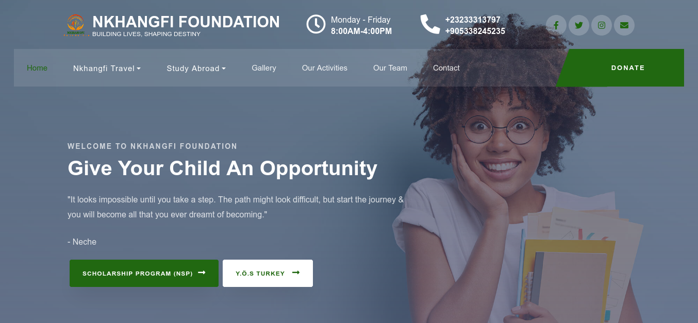

# Nkhangfi Foundation official website
> This project was built using react. Although using react for a website like this is overkill in my opinion but I was experienting with react at the start of the project and I wanted to introduce more features in the future like creating accounts, payments e.t.c

## Visit the site
Open [nkhangfifoundation.com](https://nkhangfifoundation.com)

## Built With
- React,
- CSS,
- Bootstrap

## Author
👤 **Chukwuebuka Paul Ajuizeogu**
- Github: [@misterpaul4](https://github.com/misterpaul4)
- Linkedin: [Chukwuebuka Paul Ajuizeogu](https://www.linkedin.com/in/chukwuebuka-paul-ajuizeogu/)

## Acknowledgment
- colordib
- fontawesome
- formspark
- unsplash
